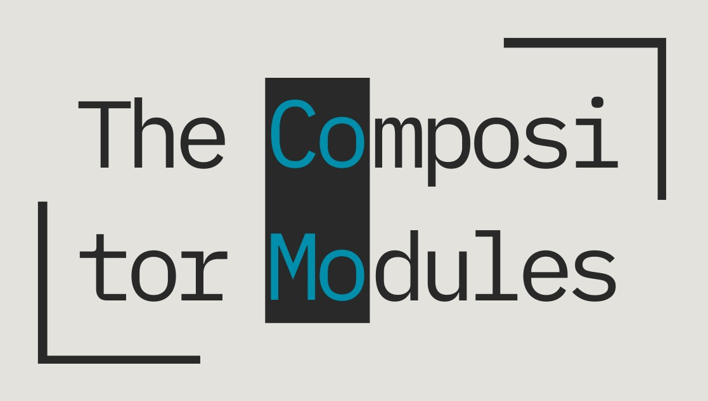

<!--
SPDX-FileCopyrightText: 2024 Roman Gilg <subdiff@gmail.com>

SPDX-License-Identifier: GPL-2.0-or-later
-->

    <picture>
      <source media="(prefers-color-scheme: dark)" srcset="docs/assets/logo-dark-wide.png">
      <source media="(prefers-color-scheme: light)" srcset="docs/assets/logo-bright-wide.png">
      
    </picture>

<i>The Compositor Modules (COMO)</i> are a robust and versatile set of libraries
 
to create compositors for the Wayland and X11 windowing systems on Linux.

# Features

**Compatibility**
 
The Compositor Modules currently integrate primarily with
KDE's Plasma Desktop but can be used with other desktop environments as well.
This cross-desktop interoperability will be expanded upon in the future.

**Ease of Use**
 
With The Compositor Modules a Wayland compositor can be created with a handful of lines only.
See our MVP [Minico](tests/minico) for an example of that.

**Customizability**
 
The Compositor Modules make heavy use of C++ templates. This allows consumers to replace
many functions and types with customized versions when required.

## Wayland Feature Table
X11 support is feature complete.
For the current state of Wayland the following table provides a detailed look at available and planned features.

| Feature             |                         | Available                                                                              | Planned                                                                   |
| ------------------- | ----------------------- | -------------------------------------------------------------------------------------- | ------------------------------------------------------------------------- |
| Composition         | :white_check_mark:      | With OpenGL or in software                                                             |                                                                           |
| Input methods       | :white_check_mark:      | [text-input v2][text-input-v2] [v3][text-input-v3], [input-method v2][input-method-v2] |                                                                           |
| Primary selection   | :white_check_mark:      | [primary-selection][primary-selection] protocol                                        |                                                                           |
| Xwayland            | :white_check_mark:      | Optional at run *and* compile time                                                     |                                                                           |
| VR                  | :white_check_mark:      | [DRM lease][drm-lease] protocol support                                                |                                                                           |
| Adaptive sync / VRR | :white_check_mark:      | Via wlroots [backend][wlr-adaptive-sync] and [protocol][wlr-prot-adaptive-sync]        |                                                                           |
| Present feedback    | :white_check_mark:      | [presentation-time][presentation-time] protocol support                                |                                                                           |
| CSD and SSD         | :white_check_mark:      | CSD by convention and KWin SSD                                                         |                                                                           |
| Windowing logic     | :ballot_box_with_check: | Floating WM; optional rules, scripts                                                   | Tiling WM functions                                                       |
| Effects             | :ballot_box_with_check: | KWin effects plugins                                                                   | Plugin system similar to Wayfire                                          |
| Desktop shells      | :ballot_box_with_check: | KDE Plasma, [wlr-layer-shell][wlr-layer-shell]                                         | [wlr-foreign-toplevel-management][wlr-foreign-toplevel-management]        |
| Lockscreen          | :ballot_box_with_check: | KDE Plasma lockscreen integration                                                      | [session-lock][session-lock] protocol                                     |
| Fractional scaling  | :ballot_box_with_check: | Downscaling for Wayland surfaces                                                       | Xwayland, [factional-scale][factional-scale] protocol                     |
| Output control      | :ballot_box_with_check: | [wlr-output-management][wlr-output-management]                                         | [Mirroring][clone-wlroots-mr]                                             |
| Configuration       | :ballot_box_with_check: | KWin config files via [KConfig][kconfig]                                               | Generic API independent of KDE                                            |
| Video capture       | :x:                     |                                                                                        | Using xdg-portals and pipewire                                            |
| HDR                 | :x:                     |                                                                                        | When [protocol][color-management-protocol] lands or [KWin-like][hdr-kwin] |
| Direct scanout      | :x:                     |                                                                                        | With more wlroots render integration                                      |
| Vulkan render       | :x:                     |                                                                                        | With more wlroots render integration                                      |
| Graphic tablets     | :x:                     |                                                                                        | [tablet][tablet-protocol] protocol                                        |
| Multiseat           | :x:                     |                                                                                        | Full support, but low priority                                            |
| C++20 modules       | :x:                     |                                                                                        | When compiler support improves                                            |
| No Qt/KDE linking   | :x:                     |                                                                                        | For a subset of features                                                  |

<!------------------------------------------------------------------------------------------------>
[clone-wlroots-mr]: https://gitlab.freedesktop.org/wlroots/wlr-protocols/-/merge_requests/116
[presentation-time]: https://gitlab.freedesktop.org/wayland/wayland-protocols/-/tree/main/stable/presentation-time
[drm-lease]: https://gitlab.freedesktop.org/wayland/wayland-protocols/-/tree/main/staging/drm-lease
[vrr]: https://en.wikipedia.org/wiki/Variable_refresh_rate
[kconfig]: https://api.kde.org/frameworks/kconfig/html/
[wlr-adaptive-sync]: https://gitlab.freedesktop.org/wlroots/wlroots/-/blob/842093bb843ae6c719c2b1cf32eb749cab9e46ca/include/wlr/types/wlr_output.h#L87
[wlr-prot-adaptive-sync]: https://gitlab.freedesktop.org/wlroots/wlr-protocols/-/blob/2b8d43325b7012cc3f9b55c08d26e50e42beac7d/unstable/wlr-output-management-unstable-v1.xml#L344-L357
[text-input-v2]: https://github.com/winft/wrapland/blob/master/server/text_input_v2.h
[text-input-v3]: https://gitlab.freedesktop.org/wayland/wayland-protocols/-/blob/main/unstable/text-input/text-input-unstable-v3.xml
[input-method-v2]: https://github.com/swaywm/wlroots/blob/master/protocol/input-method-unstable-v2.xml
[factional-scale]: https://wayland.app/protocols/fractional-scale-v1
[wlr-foreign-toplevel-management]: https://wayland.app/protocols/wlr-foreign-toplevel-management-unstable-v1
[wlr-layer-shell]: https://wayland.app/protocols/wlr-layer-shell-unstable-v1
[wlr-output-management]: https://wayland.app/protocols/wlr-output-management-unstable-v1
[session-lock]: https://wayland.app/protocols/ext-session-lock-v1
[primary-selection]: https://wayland.app/protocols/primary-selection-unstable-v1
[color-management-protocol]: https://gitlab.freedesktop.org/wayland/wayland-protocols/-/merge_requests/14
[hdr-kwin]: https://zamundaaa.github.io/wayland/2023/12/18/update-on-hdr-and-colormanagement-in-plasma.html
[tablet-protocol]: https://wayland.app/protocols/tablet-unstable-v2
<!------------------------------------------------------------------------------------------------>

# Tenets

**Stability and Robustness**

This is achieved through upholding strict development standards
and deploying modern development methods to prevent regressions and code smell.

**Collaboration With Downstream and Upstream Partners**

We want to overcome antiquated notions on community division
and work together on the best possible Linux graphics platform instead.

**Value the Knowledge of Experts and the Curiosity of Beginners**

Well defined and transparent decision processes enable expert knowledge to proliferate
and new contributors to easily find help on their first steps.

# Installation
The Compositor Modules can be compiled from source.
If you do that manually you have to check for your specific distribution
how to best get the required dependencies.

You can also make use of the FDBuild tool to automate that process as described
[here](CONTRIBUTING.md#compiling).

# Usage
It's easiest to link via CMake to The Compositor Modules libraries that you want to make use of
and then create their central platform types from your main function to launch the compositor session.

[Minico](tests/minico) as a minimal example and the [Plasma test binaries](tests/plasma)
as a more complex one demonstrate this in a straightforward way.

# Development
The [CONTRIBUTING.md](CONTRIBUTING.md) document contains all information
on how to get started with:
* providing useful debug information,
* building The Compositor Modules
* and doing your first code submission to the project.

# Contact
Issue tickets can be created for feature requests, bug reports or general discussions.
For direct communication join our [Matrix room](https://matrix.to/#/#como:matrix.org).
